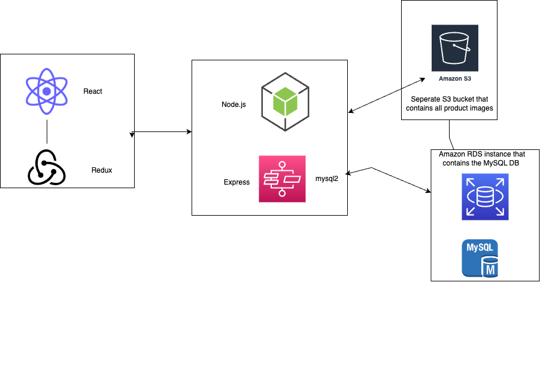

# SkateShop Backend Documentation

### This is the documentation for the backend of the SkateShop project built using Node.js and Express.

## Table of Contents

- [Requirements](#requirements)
- [Installation](#installation)
- [Scripts](#scripts)
- [Dependencies](#dependencies)
  - [Production](#production-dependencies)
  - [Development](#development-dependencies)
- [Backend Routes and Functionality](#backend-routes-and-functionality)

## Requirements

- Node.js
- npm

## Installation

To install the required dependencies, run the following command in the project directory:

- npm install

## Scripts

The project includes the following npm scripts:

    npm run test

- `test`: Runs tests using Jest.
  npm run start
- `start`: Starts the server using the `server.js` file.
  npm run dev
- `dev`: Starts the server using Nodemon for automatic restarts on file changes.

## Dependencies

### Production Dependencies

The project uses the following production dependencies:

- `@aws-sdk/client-s3`: AWS SDK for JavaScript, specifically the S3 client.
- `aws-sdk`: AWS SDK for JavaScript.
- `bcrypt`: A library for hashing passwords.
- `cors`: Middleware for enabling CORS (Cross-Origin Resource Sharing) with various options.
- `dotenv`: Loads environment variables from a `.env` file.
- `express`: Web framework for Node.js.
- `express-rate-limit`: Middleware for rate-limiting requests to the API.
- `jsonwebtoken`: A library for JSON Web Token implementation.
- `multer`: Middleware for handling `multipart/form-data` (used for file uploads).
- `multer-s3`: Middleware for uploading files to Amazon S3 using Multer.
- `mysql2`: A MySQL client for Node.js.
- `sharp`: High-performance image processing library.
- `winston`: A logger library.

### Development Dependencies

The project uses the following development dependencies:

- `jest`: JavaScript testing framework.
- `supertest`: HTTP testing library

## Backend Routes and Functionality

The backend handles various functionality for the SkateShop application, including but not limited to:

- **User Authentication**: Sign up, sign in, and user profile management.
- **Product Management**: Creating, updating, and deleting products, as well as retrieving product information and filtering by category.
- **Wishlist magnagement**: Adding, updating, and removing items from the shopping cart.
- **Order Management**: Creating, updating, and retrieving order information.
- **Admin Panel**: Allows administrators to manage products, orders, and customer information.

These functionalities are achieved through a series of API routes that interact with the application's MySql database, AWS S3 for file storage, and handle authentication using JSON Web Tokens.
